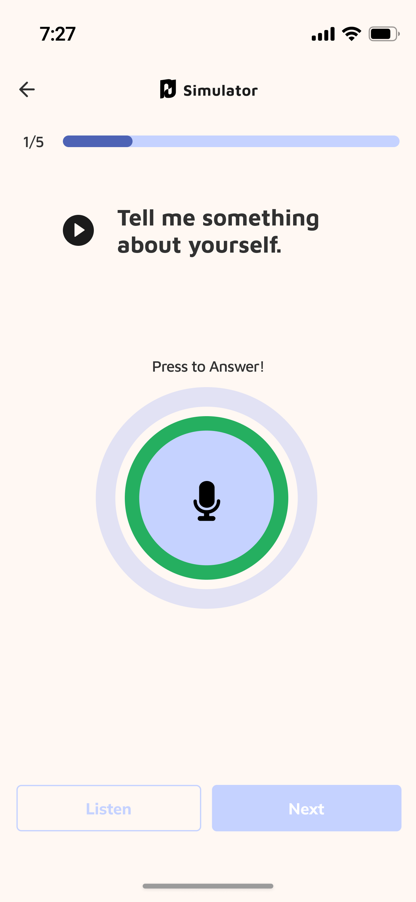
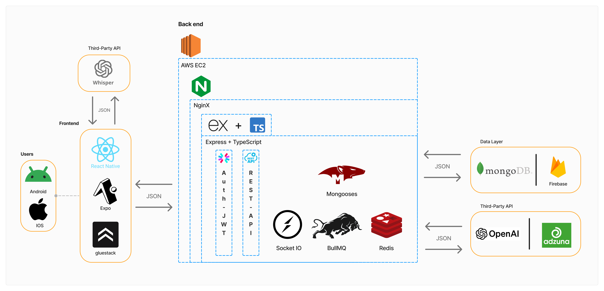

<div align="center">
  
</div>

# PrepUp - AI-Powered Interview Preparation Platform

<div align="center">
  
  
  
  
  
</div>

## 🎯 Project Overview

**PrepUp** is a comprehensive AI-powered interview preparation platform designed to help job seekers excel in their interviews. This project was developed as my final term project to demonstrate full-stack development capabilities, API integration, AI implementation, and modern software engineering practices.

### 🎥 Live Presentation
**Watch the live presentation:** [PrepUp Final Presentation](https://youtu.be/I-t8yMmM-2k?t=7311)

## ✨ Key Features

### 🤖 AI-Powered Interview Preparation
- **Smart Question Generation**: AI generates contextual interview questions based on job descriptions
- **Answer Analysis**: Real-time feedback and scoring on interview responses
- **STAR Method Training**: Specialized behavioral interview preparation using the STAR method
- **Audio Support**: Handles voice recordings and transcriptions for practice sessions

### 🔍 Job Search & Management
- **Job Discovery**: Integration with Adzuna API for real-time job listings
- **Smart Search**: Keyword-based job filtering and recommendations
- **Job Bookmarking**: Save and organize interesting job opportunities
- **Personalized Feed**: Curated job suggestions based on user profile

### 👤 User Experience
- **Authentication**: Secure JWT-based authentication with Google OAuth support
- **Profile Management**: Comprehensive user profiles with interview history
- **Real-time Updates**: Live notifications and updates via WebSocket
- **Responsive Design**: Mobile-friendly interface for on-the-go practice

## 📸 Application Preview

Here are a few snapshots of the PrepUp mobile application in action.

| Job Search | AI Interview | Answer Feedback |
| :---: | :---: | :---: |
|  |  |  |

## 🏛️ System Architecture
<div align="center">
  
</div>

## 🏗️ Technical Architecture

### Backend Stack
- **Runtime**: Node.js with TypeScript
- **Framework**: Express.js
- **Database**: MongoDB with Mongoose ODM
- **Authentication**: JWT with bcrypt password hashing
- **Real-time**: Socket.IO for live communication
- **Queue System**: BullMQ with Redis for background processing
- **AI Integration**: OpenAI GPT API for intelligent features
- **External APIs**: Adzuna for job listings, Nodemailer for email services
- **Monitoring**: Winston logging and error tracking

### Development & Deployment
- **Process Management**: PM2 for production deployment
- **API Documentation**: Swagger/OpenAPI with interactive docs
- **Environment Management**: Environment-based configuration
- **CI/CD**: Automated deployment scripts

## 🚀 Getting Started

### Prerequisites
- Node.js (v16 or higher)
- MongoDB
- Redis (for queue management)
- PM2 (for production)

### Installation

1. **Clone the repository**
   ```bash
   git clone https://github.com/yourusername/prepup-backend.git
   cd prepup-backend
   ```

2. **Install dependencies**
   ```bash
   npm install
   ```

3. **Environment Setup**
   Create a `.env` file in the root directory:
   ```env
   # Database
   DB_CONN_STRING=your_mongodb_connection_string
   DB_NAME=prepup_db
   USERS_COLLECTION_NAME=users

   # Authentication
   TOKEN_KEY=your_jwt_secret_key

   # Email Service
   MAIL_HOST=your_smtp_host
   MAIL_USERNAME=your_email
   MAIL_PASSWORD=your_password

   # AI Services
   CHATGPT_API_URL=https://api.openai.com/v1/chat/completions
   CHATGPT_API_KEY=your_openai_api_key
   GPT_MODEL=gpt-3.5-turbo

   # Job Search API
   ADZUNA_API_URL=https://api.adzuna.com/v1/api/jobs/gb/search
   ADZUNA_API_ID=your_adzuna_app_id
   ADZUNA_API_KEY=your_adzuna_api_key

   # Server
   PORT=4000
   NODE_ENV=development
   ```

4. **Build and Run**
   ```bash
   # Development
   npm run dev

   # Production
   npm run build
   npm start
   ```

5. **Access API Documentation**
   Visit `http://localhost:4000/api-docs` for interactive API documentation

## 📚 API Endpoints

### Authentication
- `POST /api/auth/signup` - User registration
- `POST /api/auth/signin` - User login
- `POST /api/auth/signinWithGoogle` - Google OAuth login
- `POST /api/auth/forgotPassword` - Password recovery

### Interview Management
- `POST /api/interview/generateQuestions` - Generate AI questions
- `POST /api/interview/analyzeAnswers` - Analyze interview responses
- `GET /api/interview/category` - Get interview categories

### Job Search
- `GET /api/jobFinder/jobs/:page` - Get job listings
- `GET /api/jobFinder/jobs/search/:page` - Search jobs by keyword
- `POST /api/jobFinder/bookmark` - Bookmark a job
- `DELETE /api/jobFinder/bookmark/:jobId` - Remove bookmark
- `GET /api/jobFinder/bookmarks` - Get bookmarked jobs

### User Profile
- `GET /api/profile` - Get user profile
- `PUT /api/profile` - Update profile
- `DELETE /api/profile` - Delete account

### STAR Method Training
- `GET /api/starMaster/question` - Get random STAR question
- `POST /api/starMaster/analyze` - Analyze STAR method answers

## 🔧 Development Features

### Code Quality
- **TypeScript**: Full type safety and better development experience
- **ESLint**: Code linting and formatting
- **Modular Architecture**: Clean separation of concerns
- **Error Handling**: Comprehensive error management

### Performance
- **Database Indexing**: Optimized MongoDB queries
- **Caching**: Redis-based caching for frequently accessed data
- **Queue Processing**: Background job processing for heavy operations
- **Load Balancing**: PM2 cluster mode for horizontal scaling

### Security
- **JWT Authentication**: Secure token-based authentication
- **Password Hashing**: bcrypt for password security
- **Input Validation**: Request validation and sanitization
- **CORS Configuration**: Cross-origin resource sharing setup

## 📊 Project Metrics

- **Lines of Code**: 2000+ lines of TypeScript
- **API Endpoints**: 15+ RESTful endpoints
- **Database Collections**: 4 main collections
- **External Integrations**: 3 third-party APIs
- **Test Coverage**: Comprehensive error handling and validation

## 👥 Meet the Team

This project was a collaborative effort by a dedicated team of developers. Connect with us on GitHub!

- **Khushal Khunt** - [FTW-Khushal](https://github.com/FTW-Khushal)
- **Shunsaku Sugita** - [shunsaku-sugita](https://github.com/shunsaku-sugita)
- **Yohei Tarutani** - [yohei-tarutani](https://github.com/yohei-tarutani)
- **Blanca Sanchez** - [Blanca-sf](https://github.com/Blanca-sf)

## 🎓 Learning Outcomes

This project demonstrates proficiency in:

- **Full-Stack Development**: Complete backend API development
- **AI Integration**: OpenAI API implementation for intelligent features
- **Database Design**: MongoDB schema design and optimization
- **API Design**: RESTful API development with comprehensive documentation
- **Authentication**: JWT and OAuth implementation
- **Real-time Features**: WebSocket integration for live updates
- **Deployment**: Production deployment with PM2 and automated scripts
- **Third-party Integration**: Multiple external API integrations
- **Error Handling**: Robust error management and logging
- **Code Organization**: Clean, maintainable, and scalable code structure

## 🔗 Links

- **Live Demo**: [https://prepup.ca/](https://prepup.ca/)
- **API Documentation**: [https://api.prepup.ca/api-docs](https://api.prepup.ca/api-docs)
- **Frontend Repository**: [shunsaku-sugita/prepup-frontend](https://github.com/shunsaku-sugita/prepup-frontend)
- **Presentation Slides**: [Add your presentation slides link]

---

<div align="center">
  <p>Built with ❤️ for interview preparation</p>
</div>
